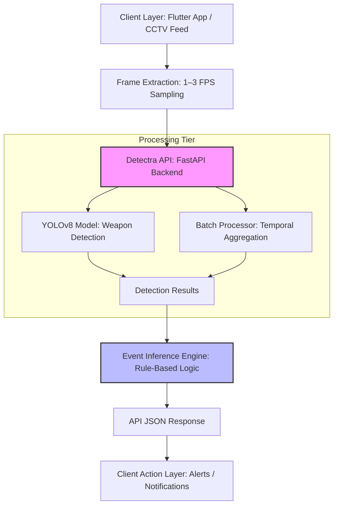

# Detectra API 

Detectra API is a high-performance, lightweight backend service designed for real-time violence detection. Optimized for YOLOv8 and heuristic activity inference, it provides robust endpoints for analyzing image feeds while remaining highly efficient on CPU-bound hardware like Oracle A1 Flex and AMD Ryzen.

## Table of Contents
1. [Key Features](#key-features)
2. [Stateless Architecture](#stateless-architecture)
3. [Tech Stack](#tech-stack)
4. [System Requirements](#system-requirements)
5. [Limitations](#limitations)
6. [Setup & Installation](#setup--installation)
7. [Deployment Instructions](#deployment-instructions)
8. [API Documentation](#api-documentation)
9. [Performance](#performance)
10. [License](#license)

## Key Features

- **YOLOv8 Engine (Object Detection)**: Detects weapons such as guns, pistols, and knives.
- **Stateless API Design**: Enables effortless horizontal scaling via container replication and load balancing.
- **Heuristic Activity Inference**: Violent activities are inferred using multi-frame analysis and rule-based aggregation over detection outputs.
- **WebP Native Support**: Fully supports WebP format, allowing for high-quality analysis with up to 80% lower bandwidth consumption.
- **Batch Processing**: Support for temporal smoothing through multi-frame analysis.

---

## Stateless Architecture

The following diagram illustrates the high-level flow from frame capture to event inference:



> **Note**: The entire backend infrastructure operates as a stateless service within a Docker environment (Portainer) on a VPS.

---

## Tech Stack

- **Framework**: [FastAPI](https://fastapi.tiangolo.com/)
- **Machine Learning**: [PyTorch](https://pytorch.org/), [Ultralytics (YOLOv8)](https://github.com/ultralytics/ultralytics)
- **Deployment**: Docker, Docker Compose, Portainer

## System Requirements

### Operational Modes
- **Lightweight Mode (2GB RAM Required)**: Stub inference for logic testing and API flow validation.
- **Inference Mode (4GB+ RAM Required)**: Full ensemble loading with active hardware-bound detection.

## Limitations

- **Temporal Context**: Utilizes frame-based inference. While temporal smoothing is applied over batches, it lacks native 3D/video-tensor understanding.
- **Contextual Nuance**: Limited accuracy for complex behavioral activities (e.g., distinguishing between play-fights and real violence).
- **Environmental Dependency**: Highly dependent on camera visibility, angle, and lighting conditions.

---

## API Documentation

### Response Specification

#### Detection Output (`/detect-batch`)
Returns a consolidated report for each frame in the batch plus an aggregated summary.

```json
{
  "results": [
    {
      "filename": "frame_001.webp",
      "weapons": [{"type": "pistol", "confidence": 0.89, "box": [10.2, 50.1, 40.5, 90.2]}],
      "violence": {"detected": true, "confidence": 0.75},
      "alert": true
    }
  ],
  "aggregated": {
    "alert": true,
    "total_alerts": 1,
    "method": "majority_vote"
  }
}
```

---

## Performance
- **Cold Start**: ~3s
- **Inference Latency (CPU)**: 
    - Single Frame: ~200ms – 600ms
    - Batch Mode: Improved throughput via parallel tensor inference
- **Max Throughput**: Scalable via Docker workers (Standard: 2-3 concurrent requests per worker).

## License
This project is developed for educational purposes only and you're allowed to adapt to your specific need/requirements.
